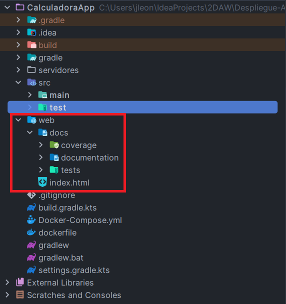
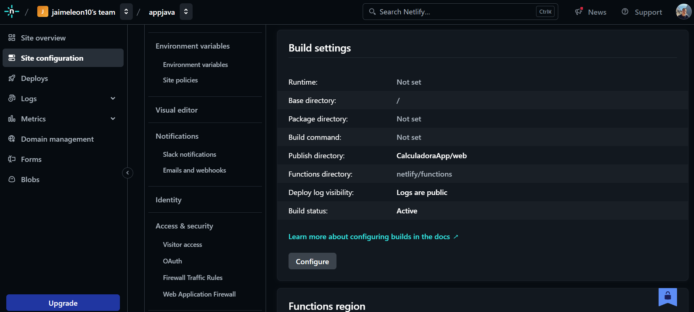
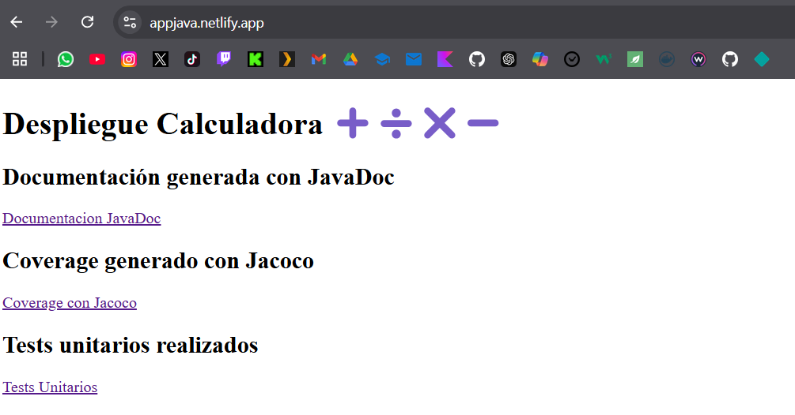
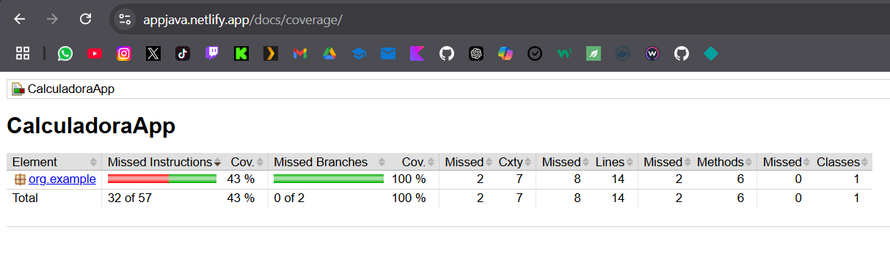

# Despliegue-Avanzado
Repositorio con un proxy inverso que desplegará distintos datos de una app en varios contenedores haciendo uso de volúmenes con la herramienta Docker.

## Imágenes

### Carpeta con archivos estáticos

### Configuración de despliegue

### Presentación web con Netlify

### Documentación

### Coverage

### Tests

## Autor
<a href="https://github.com/jaimeleon10">Jaime León Mulero</a>
